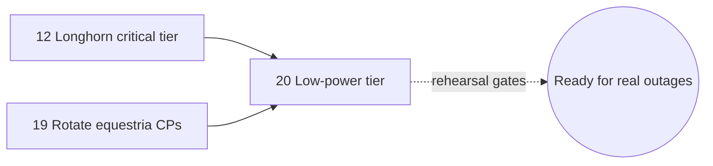

# 20 — Low-power / control-plane-only operating mode (S′)

Sub-issue anchor **S′** ([vault#84](https://github.com/david-driscoll/vault/issues/84),
[Expansion v2.1](https://github.com/david-driscoll/vault/issues/84#issuecomment-5138811583)
§3, "Q-E"). Implements decision **D6**: a deliberate 3–4h+ operating posture, on battery,
where the cluster "limps along" on control planes alone. This is not a disaster-recovery
mode — it is a *planned* posture David enters on purpose, on Pecron F3000LFP battery power,
runbook-driven.

> *"I want to ensure that the cluster can still limp along if the 3 control plane nodes are
> all that is running (during low power situations). It should run the minimum critical
> services if possible."* — [Q-E answer](https://github.com/david-driscoll/vault/issues/84#issuecomment-5112326099)
>
> *"Ideally the cluster could run in a low power state for 3 to 4 hours, or more. They are
> connected to [a Pecron F3000LFP portable power station](https://www.pecron.com/products/pecron-f3000lfp-portable-power-station-3600w-3072wh)
> with 2 others available as needed for outages."* — [follow-up](https://github.com/david-driscoll/vault/issues/84#issuecomment-5149201734)
>
> *"Yes, home assistant is tier 1, if the lights stop working the wife gets upset."* — [same comment](https://github.com/david-driscoll/vault/issues/84#issuecomment-5149201734)

**Read this file standalone.** It does not assume you have read vault#84. Where this file
disagrees with the July/August 2026 discovery comments quoted above, **this file is
correct** — it was re-verified against the live repos on **2026-08-13**, after the
[OpenBao migration](https://github.com/david-driscoll/vault/blob/main/docs/openbao-migration/STATUS.md)
completed, which the original design (2026-07-31) predates.

## Where this sits in the plan

This is **Phase 8b** in the discovery comments' numbering — [00-README](README.md) calls it
piece **20 (S′)**. It assumes the end-state topology from
[19-rotate-equestria-control-planes.md](19-rotate-equestria-control-planes.md): control
planes are `milky-way` / `othalla` / `pegasus` (ex-SGC), workers are `hard-hat` /
`fluttershy` / `kerfuffle` / `shining-armor` (ex-equestria CPs + the original worker). It
also assumes [12-longhorn-critical-tier.md](12-longhorn-critical-tier.md)'s storage
tagging has landed — **do not attempt this mode before 12 is live**; without it, powering
off the workers silently takes Tier-1 volumes with them (§5).



---

## 1. The tiers, updated for the OpenBao era

Three tiers, unchanged in shape from v2.1 §3.1. **Tier 0** is the cluster platform — without
it nothing runs. **Tier 1** is the estate services that justify keeping the cluster up at
all during an outage. **Tier 2** is everything else, and goes down when the workers do.

**Tier 0 — cluster platform (mandatory)**

`cilium` + `cilium-operator` · `coredns` · `external-secrets` (+ webhook, cert-controller) ·
`onepassword-connect` (+ operator) · `reflector` · `reloader` · `metrics-server` ·
`snapshot-controller` · `spegel` · `registry` · `multus` · `longhorn` (manager, CSI, engine
images, instance-managers) · `csi-driver-nfs` · `cert-manager` + `trust-manager` ·
`cloudnative-pg` operator (the *operator* — not the shared cluster it manages, see §2) ·
`flux-operator` + the four Flux controllers · `volsync` · `openebs` localpv

Two notes that update this list past v2.1:

- **`onepassword-connect` stays in Tier 0**, and it looks stranger than it is now that the
  OpenBao migration is done. 1Password no longer sources any secret in the cluster, but it
  is still the write path for PBS-item backups (README's "what changed" §1), and
  `kubernetes/apps/kube-system/external-secrets/stores/ks.yaml` still lists it as a
  `dependsOn` for the `external-secrets-stores` Kustomization (equestria-cluster,
  2026-08-13) — which `openbao`'s own Kustomization transitively depends on. Dropping this
  from Tier 0 without also removing that dependency edge means OpenBao itself can't boot.
- **`openbao` (the workload) is deliberately *not* in Tier 0 or Tier 1.** See §2 — this is
  the load-bearing decision this file adds on top of v2.1.

**Tier 1 — estate services**

`technitium` + `technitium-dns` (DNS) · `k8s-gateway` · `traefik` · `cloudflare-dns` ·
`cloudflare-tunnel` · `unifi-dns` · `error-pages` · `chrony` (NTP) · `mosquitto` (MQTT) ·
`home-assistant` · `tailscale-operator` + connectors + `tsidp`

Verified update: as of 2026-08-13, `chrony`, `mosquitto`, `home-assistant` and a fourth app
(`matter`, not in the original five-app list — see §8 open items) already live in
equestria-cluster's own tree under **namespace `stargate-command`**
(`kubernetes/apps/stargate-command/{chrony,mosquitto,home-assistant,matter}/`), staged
ahead of [13](13-stage-sgc-apps.md)/[15](15-migrate-apps.md). `tsidp` is a one-line
`ExternalName` Service in `apps/tailscale-system/services/tailscale.yaml` pointing at
`idp.<tailnet>` — it costs nothing beyond the Tailscale operator already in this tier.
`home-assistant` is confirmed **not** node-pinned: its HelmRelease has no `nodeSelector`,
`nodeName`, or device `hostPath` (grepped 2026-08-13) — the Zigbee/Z-Wave hardware v2.1
worried about already runs separately on alpha-site (`docker/alpha-site/` has no zwave
entry for equestria). Free to pin to any control plane.

**Tier 2 — dropped in low-power**

All of `equestria` namespace (media stack, immich, n8n, windmill, romm, …) · all
`observability` (prometheus, loki, tempo, thanos, grafana, alloy) · `github-actions`
runners · `pulumi` operator · `headlamp` · `node-feature-discovery` · GPU device plugins ·
`descheduler` · `librespeed` / `openspeedtest` / `traefik-whoami` · **`database`
(CNPG shared postgres + valkey)** · **`openbao` (+ `openbao-replica`)**.

Observability during the window comes from **alpha-site**, which already runs Prometheus,
blackbox, and Gatus (`uptime.driscoll.tech`) and scrapes the estate from outside — see §6.

---

## 2. OpenBao during low-power — the decision, and why it's the only sane one

v2.1 §3.2 was written 2026-07-31, before OpenBao existed as a live workload. It correctly
noted that CNPG could drop to Tier 2 because Q-C (authentik → alpha-site) removed the only
Tier-1 consumer of Postgres. What it couldn't account for: **OpenBao now runs in-cluster,
backed by that same shared CNPG postgres**
(`kubernetes/apps/kube-system/openbao/ks.yaml`, equestria-cluster, comment: *"Storage is
the shared CNPG cluster, so postgres has to be up first"*), and External Secrets Operator
now reads live secrets from it in normal operation
(`kubernetes/apps/kube-system/external-secrets/stores/openbao-store.yaml`:
`server: http://openbao-active.kube-system.svc.cluster.local:8200`). That's a new
dependency the discovery comments never priced in, and it's exactly the kind of thing the
brief for this plan asked to be checked before assuming the old tiering still holds.

**Two options, and the choice matters:**

- **(a) Accept OpenBao dark during low-power.** Existing Kubernetes Secrets — already
  synced by ESO before the window opened — keep working. ESO's reconcile loop fails to
  refresh them (logs an error, sets a `SecretSyncedError` condition) but does **not**
  delete or blank an already-synced `Secret` object on a failed refresh. No secret rotation
  happens for the duration. Pods that restart during the window read the cached `Secret`
  from the API server, not from OpenBao — nothing calls OpenBao at pod-start time.
- **(b) Pull OpenBao + a CNPG instance into Tier 1.** Rejected. `longhorn-local`
  (`kubernetes/apps/longhorn-system/storageclass/snapshot.yaml`, home-operations
  `main`@2026-08-13, unchanged from v2.1's finding) is `dataLocality: strict-local`,
  `numberOfReplicas: "1"`. A CNPG instance's PV is bound to the exact node it was *created*
  on and cannot be rescheduled — only destroyed and re-provisioned. Getting a CNPG instance
  onto a control plane for low-power would mean deliberately creating (not migrating) an
  instance there today, permanently, which fights the anti-affinity that already spreads
  the 3-instance cluster and adds a stateful, backup-relevant workload to the three nodes
  that are supposed to be the *stable*, boring part of this design.

**Live confirmation that (a) costs nothing extra to enforce.** OpenBao's three pods today
(2026-08-13) run on `shining-armor`, `fluttershy` and `hard-hat` — a worker and two nodes
[19](19-rotate-equestria-control-planes.md) rotates *out* of the control plane. None run on
a node that will end up in the future critical tier, and none ever will by construction: §4's
`node-role.driscoll.tech/critical` taint gets no matching toleration in OpenBao's
`HelmRelease`, so once that taint lands, OpenBao's pods are structurally barred from
scheduling onto `milky-way`/`othalla`/`pegasus` regardless of where the scheduler would
otherwise put them — this isn't a placement decision this piece has to make, it falls out of
simply *not* adding OpenBao to the Tier-0/1 toleration list in §4.

**Recommendation: (a).** It costs "no secret rotation for 3–4+ hours," which is a good
trade against pinning a database onto the control-plane trio forever.

**The hot-path check the brief asked for, done:** grepped every `ExternalSecret`,
`HelmRelease`, and `Kustomization` across `equestria-cluster/kubernetes` for a Vault CSI
driver, a `vault-agent` sidecar, or any in-app client dialing OpenBao directly
(2026-08-13) — **none exist**. The only thing in the entire tree that talks to OpenBao's
API is the `ClusterSecretStore/openbao` object consumed by ESO's controller. Every consumer
is one hop removed: app → mounted env/volume → `Secret` → ESO → OpenBao. There is no
hot path. This is what makes (a) safe rather than merely convenient.

**One more thing that falls out of (a) for free, and wasn't true in v2.1's design:** once
this file's taint (§4) lands, `openbao`'s `StatefulSet` and CNPG's instances have **no
toleration for it**. They are not merely *discouraged* from landing on a control plane —
they structurally *cannot* schedule there going forward, for any reason, including
Kubernetes rebalancing after the taint exists. Option (b) doesn't just cost more; after
this piece ships, it requires reverting part of it.

**What quietly pauses, and why that's fine:** `openbao-replica`'s nightly `pg_dump` (03:00)
and monthly restore-test CronJobs (`kubernetes/apps/kube-system/openbao-replica/`) depend
on `openbao` and therefore on the CNPG cluster; both go idle for the window. Their Gatus
heartbeats on alpha-site (`docker/alpha-site/uptime/config/openbao-break-glass.yaml`)
tolerate 26h (dump) and 792h/33d (restore-test) of silence before alerting — a 3–4h window
does not trip either, even if it happens to straddle 03:00.

---

## 3. Does it fit — capacity

Re-quoting v2.1 §3.2's measurement, **dated 2026-07-31**, because it hasn't been
re-verified live since (see §7's rehearsal requirement — that re-verification is *part of*
the gate, not a nice-to-have):

> Three sgc nodes, verified allocatable: **11.85 cores / 44.55 GiB**. Anchored on sgc's own
> live footprint (149 pods, 8,201m / 21.1 GiB requested, 4,655m / 25.1 GiB actual) and
> adjusted for the post-merge tier (− authentik ~1.9 GiB now off-cluster, − CNPG ~2.5 GiB,
> − observability ~3.0 GiB, − NFD/GPU/headlamp ~0.7 GiB, + the larger equestria apiserver
> ~+1.4 GiB × 3): **≈ 3.9 cores of 11.85 and ≈ 21.5 GiB of 44.55**, roughly 2× headroom on
> both axes. etcd itself is unmeasured (a Talos host service, invisible to `kubectl top`).

Three things have changed since that measurement that this file's authors could not
re-run live (no cluster access at authoring time — flagged for the rehearsal in §7 rather
than asserted here):

1. **OpenBao is dropped, not added**, per §2 — no Tier-1 budget impact.
2. **The `matter` app** now staged alongside chrony/mosquitto/home-assistant
   (`kubernetes/apps/stargate-command/matter/`) is new since v2.1 and unbudgeted. Small
   (it's a Matter/Thread bridge, typically well under 200m/256Mi), but count it before
   relying on the 2× headroom figure.
3. **`home-assistant` currently runs `priorityClassName: system-cluster-critical`**
   (`kubernetes/apps/stargate-command/home-assistant/helmrelease.yaml`, verified
   2026-08-13) rather than a scoped class — see §4's PriorityClass recommendation, which
   changes this.

**Verdict, carried forward with the same confidence v2.1 had: capacity is not the
constraint.** The constraints are storage placement (§5) and the exit sequencing (§6),
exactly as before.

---

## 4. Placement mechanism — taint, required affinity, PriorityClass

`NoSchedule` alone only stops new arrivals; it doesn't guarantee the critical tier is
*already* running on the control planes when the workers go dark. The mechanism has to make
the critical tier live there **permanently, in normal operation too** — entering low-power
must involve zero rescheduling of anything in Tier 0/1.

**Verified starting point (equestria-cluster `talos/talconfig.yaml` and
`talos/patches/controller/cluster.yaml`, 2026-08-13):** `allowSchedulingOnControlPlanes:
true` is already set, and it's *why* neither this cluster nor SGC's nodes carry the
standard Kubernetes CP taint today. No custom `nodeTaints` exist anywhere in either
cluster's talconfig yet — this piece introduces the first one.

**Label + taint, applied to the three control planes** (`milky-way`, `othalla`, `pegasus`
post-[19](19-rotate-equestria-control-planes.md)) via Talos machine config, following the
same `nodeLabels`/`nodeAnnotations` anchor pattern already used in `talconfig.yaml`:

```yaml
# talos/talconfig.yaml — on each of the 3 control-plane node entries
    nodeLabels:
      <<: *nodeLabels               # existing anchor (node.longhorn.io/create-default-disk, etc.)
      node-role.driscoll.tech/critical: "true"
    nodeTaints:
      node-role.driscoll.tech/critical: "true:NoSchedule"
```

Every Tier-0 and Tier-1 workload's `HelmRelease`/pod spec gets **both**:

```yaml
tolerations:
  - key: node-role.driscoll.tech/critical
    operator: Equal
    value: "true"
    effect: NoSchedule
affinity:
  nodeAffinity:
    requiredDuringSchedulingIgnoredDuringExecution:
      nodeSelectorTerms:
        - matchExpressions:
            - key: node-role.driscoll.tech/critical
              operator: In
              values: ["true"]
```

DaemonSets that must cover every node regardless of tier — `cilium`, `node-exporter`,
`longhorn-manager`/CSI plugins, `spegel`, `alloy` — get the **toleration only, not the
affinity**. They already run everywhere; the taint would otherwise evict them from the
control planes for no reason.

**PriorityClass — new, following the estate's existing convention.** The only
`PriorityClass` in either cluster today is `observability-critical`
(`equestria-cluster/kubernetes/apps/observability/priority-class/priority-class.yaml`:
`value: 1000`, `preemptionPolicy: PreemptLowerPriority`) — which is for Tier-2 observability
and is *lower* than what this tier needs. Add `critical-tier` above it:

```yaml
apiVersion: scheduling.k8s.io/v1
kind: PriorityClass
metadata:
  name: critical-tier
description: Tier 0/1 low-power workloads — DNS, NTP, MQTT, Home Assistant, ingress, cluster platform.
value: 100000
globalDefault: false
preemptionPolicy: PreemptLowerPriority
```

This closes the open question left in comment-5 §9 ("above or below
`system-cluster-critical`?"): **below.** `100000` sits well above every application-tier
class and every unset (`0`) pod, but under Kubernetes' own `system-cluster-critical`
(2,000,000,000) and `system-node-critical` (2,000,001,000) — Tier 0/1 is important, but it
is not the literal control-plane machinery those two classes exist for, and letting an
app-tier class outrank them would be a mistake if a control plane is ever actually starved.
Priority governs preemption under contention, not placement — with workers off, Tier-2 pods
just go `Pending`; they were never going to preempt anything on a tainted node. Its value is
for the case a control plane is *lost* during the window and survivors need to evict the
right things.

**Concrete correction to make while wiring this up:** `home-assistant` currently sets
`priorityClassName: system-cluster-critical` directly
(`kubernetes/apps/stargate-command/home-assistant/helmrelease.yaml`, line ~40, verified
2026-08-13). That's a real Kubernetes system-reserved class handed to an application pod —
change it to `critical-tier` in the same change that adds the taint/affinity, so Home
Assistant sits at the same priority as the rest of Tier 1 rather than one that can preempt
genuine control-plane components.

**Longhorn's taint-toleration setting is the awkward one, and it hasn't been touched yet.**
Verified live in `kubernetes/apps/longhorn-system/longhorn/values.yaml`
(home-operations `main`, 2026-08-13): `taintToleration` is commented out. Once the CP taint
exists, Longhorn's instance-managers need the matching `taintToleration` value or they stop
scheduling on the control planes — which would silently drop those three nodes' entire
storage contribution, including the `longhorn-critical` replicas this whole design depends
on. Per [Longhorn's docs](https://longhorn.io/docs/1.9.0/advanced-resources/deploy/taint-toleration/),
for the setting to apply immediately you must stop workloads and detach volumes first; with
volumes attached it only reaches Instance Manager once no engine/replica instances are
running there, otherwise it waits roughly an hour for the next sync. **This is
[12](12-longhorn-critical-tier.md)'s job, scheduled as its own early maintenance step before
any workload relies on the taint** — piece 20 assumes it is already done, not something to
retrofit during an actual low-power entry.

---

## 5. Storage placement

Owned by [12-longhorn-critical-tier.md](12-longhorn-critical-tier.md): tag the 3 control
planes `critical` and the 4 workers `bulk`, add a `longhorn-critical` StorageClass
(`numberOfReplicas: "3"`, `nodeSelector: "critical"`) for the Tier-1 volumes
(`technitium`, `home-assistant`, `mosquitto`, and `matter` pending the §8 item 4 Tier call),
and — the part that makes this safe *by construction* — add `nodeSelector: "bulk"` to the
default `longhorn` StorageClass so no untagged Tier-2 volume can ever place or replenish a
replica onto a control-plane disk. (`registry` is Tier 0 — §1 — and any `longhorn-critical`
case for it would be argued on that basis, not as a Tier-1 volume.)

**This file's job is the runbook that depends on it**, and here is where the picture has
genuinely changed since v2.1, verified live against `home-operations` `main`
(`kubernetes/apps/longhorn-system/longhorn/values.yaml`) on 2026-08-13:

| Setting | v2.1 said (2026-07-31) | Live today (2026-08-13) |
|---|---|---|
| `nodeDrainPolicy` | `block-for-eviction-if-contains-last-replica` | **`allow-if-replica-is-stopped`** |
| `nodeDownPoddeletionPolicy` | `do-nothing` | **`Delete-both-statefulset-and-deployment-pod`** |

Both changed since v2.1 was written, for an unrelated reason: `block-for-eviction` was
deadlocking `tuppr` Talos upgrades on `longhorn-local` volumes (the same
strict-local/hard-affinity trap as §2 — the rebuild it wants can never be scheduled, so the
old policy held the drain and the PDB open forever). The commit message and inline comment
(`kubernetes/apps/longhorn-system/longhorn/values.yaml`) are explicit about the fix and its
tradeoff: *"if a drained node never comes back, a single-replica volume on it is lost. That
is already true for every `longhorn-local` volume by construction."*

**What this changes for the enter/exit runbook (§6):** v2.1's reasoning for "cordon, do not
drain" was specifically to dodge `block-for-eviction`'s hang. That hazard is gone — the live
policy no longer blocks a drain waiting on an unschedulable rebuild. But the *conclusion*
("cordon, do not drain, then power off directly") is still correct, for a re-derived
reason: this runbook never calls `kubectl drain` at all, so neither drain policy actually
engages. What **does** engage is `nodeDownPoddeletionPolicy`. Once Longhorn's node-down
detection fires on a worker that's been shut off, it will now actively **delete** every
Tier-2 pod on that node — both `StatefulSet`- and `Deployment`-owned — rather than leaving
them sitting `Terminating` as v2.1 assumed. Kubernetes' normal controllers then try to
recreate them. With four workers off and the critical-tier taint in place (§4), those
Tier-2 pods have nowhere to schedule and simply pile up `Pending` — noisy in `kubectl get
pods -A`, harmless in practice, and arguably *better* than the old behavior (nothing is
stuck in a half-torn-down state waiting for a node that isn't coming back soon). Expect
`Pending`, not `Terminating`, and don't treat a wall of `Pending` Tier-2 pods as a problem
during a low-power window — it's this policy doing exactly what it now does.

---

## 6. Entering and leaving low-power mode

**Enter:**

1. **Pre-check.** Every Tier-0/Tier-1 pod `Running` on `milky-way`/`othalla`/`pegasus`.
   Every `longhorn-critical` volume `healthy` with 3 replicas on the CP trio. Zero degraded
   volumes cluster-wide. `talosctl etcd members` = 3 healthy.
2. **Verify the default StorageClass carries `nodeSelector: "bulk"`** ([12](12-longhorn-critical-tier.md)'s
   deliverable). If it isn't in place, do not proceed — fix that first, don't fall back to a
   runbook workaround.
3. **Confirm [07-authentik-to-alpha-site.md](07-authentik-to-alpha-site.md) has landed.**
   This mode assumes identity is already off-cluster. If authentik is still in-cluster
   (backed by CNPG, which is Tier 2 per §2), entering low-power takes SSO down with it —
   that is not this design, it's the old single-failure-domain problem D6 exists to fix.
4. `flux suspend` the Tier-2 Kustomizations; suspend `descheduler`. This doesn't stop the
   pod-deletion behavior in §5 (that's a controller-level reaction to node state, independent
   of Flux) — it stops Flux from fighting the resulting `Pending` pods or reconciling
   unrelated Tier-2 drift mid-window.
5. **`kubectl cordon` the four workers. Do not `kubectl drain`.** Cordoning prevents any new
   Tier-2 (or misplaced Tier-1) pod from landing there right before shutdown; a real drain
   is unnecessary since the nodes are about to lose power anyway, and it only adds a step
   that can hang if any pod has no eviction-safe path (a `PodDisruptionBudget` at 0
   allowed disruptions, for instance).
6. `talosctl -n <worker> shutdown` **one at a time**, verifying between each: etcd still
   3-member healthy, Cilium healthy, all `longhorn-critical` volumes still `healthy`.
7. **Post-check:** DNS resolving, NTP answering, MQTT accepting, Home Assistant reachable,
   Traefik serving, forward-auth working against alpha-site's authentik, Gatus (alpha-site)
   green for the critical set.

**Exit — this is the dangerous direction, not the entry**, exactly as v2.1 flagged, and this
is where a real hardware fact refines the runbook:

**Not all four workers need the same power-on path.** MAC vendor prefixes in the two
talconfigs settle a question v2.1 left as "three of seven nodes are bare metal, unverified":

| Worker | NIC MAC prefix (talconfig, verified 2026-08-13) | Inference |
|---|---|---|
| `shining-armor` | `bc:24:11:…` | **Proxmox/QEMU virtio OUI** — almost certainly a Proxmox VM |
| `hard-hat` | `bc:24:11:…` | **Proxmox/QEMU virtio OUI** — almost certainly a Proxmox VM |
| `fluttershy` | `58:47:ca:…` | Real hardware NIC — Intel UN1290 mini-PC, genuinely bare metal |
| `kerfuffle` | `58:47:ca:…` | Real hardware NIC — Intel UN1290 mini-PC, genuinely bare metal |

(For contrast: `milky-way`/`othalla`/`pegasus` in `stargate-command-cluster/talos/talconfig.yaml`
all carry `e0:51:d8:…` — a genuine hardware OUI, consistent with v2.1's identification of
them as GMKtec NucBox boxes. The control-plane trio this whole design is built on is real
hardware, not virtualized — no VM-host dependency for the part that must never go down.)

**This is an inference from MAC vendor prefixes, not a confirmed inventory record** — verify
which Proxmox host actually hosts `shining-armor` and `hard-hat` (`qm list` across
`celestia`/`luna`/`skystar`/`twilight-sparkle`) before relying on it. If it holds, the WoL
question shrinks from "3 of 7 nodes, unverified" to specifically **`fluttershy` and
`kerfuffle`** — the other two workers can be started with `qm start <vmid>` against
whichever Proxmox host holds them, which is trivially scriptable (even automatable) and
needs no WoL, no BIOS setting, and no hands on a power button.

1. Power on workers **one at a time**: the two VM-backed workers via `qm start` (or the
   Proxmox API) if the inference above is confirmed; `fluttershy`/`kerfuffle` via WoL (once
   verified — see §7) or physically. Wait for `Ready` **and** Cilium ready **and** the
   Longhorn node reporting `Ready` with its replicas rebuilt, before touching the next one.
2. `kubectl uncordon` each only after its Longhorn rebuild completes.
3. Unsuspend `descheduler` and the Tier-2 Kustomizations.
4. Verify zero degraded volumes and all Kustomizations reconciled before declaring it done.

**Why one at a time is non-negotiable.** This is the exact shape of the Cilium zombie-node
cascade that has already forced a physical power-cycle on SGC once: a node boots
Cilium-not-ready → its instance-manager goes `OutOfcpu` → Longhorn and CNPG wedge. Four
nodes rejoining simultaneously, each triggering a Longhorn rebuild and a burst of apiserver
writes, is that failure mode turned up — and in low-power mode the *only* etcd members are
the three control planes, whose disks are the estate's historically weakest link (etcd
fsync p99 measured 4–7× slower than equestria's original CPs — v2.1 §6, unresolved by this
piece; see [17-nvme-replacement.md](17-nvme-replacement.md)). The mass-rejoin write storm
lands squarely on the weakest component if this is rushed. **If a node comes back wrong,
check nodes and taints first, not CNPG or OpenBao.**

---

## 7. alpha-site — load-bearing during low-power, and the open PoE question

Once [07](07-authentik-to-alpha-site.md) lands, alpha-site is not a bystander during a
low-power window — it's carrying identity for the entire estate. Verified live in
`home-operations` `main` (`docker/alpha-site/`, 2026-08-13), the Dockge stacks already
running there include:

- `bao-transit` — the transit-seal key OpenBao unseals against on boot. Irrelevant to a
  *dark* OpenBao (§2), but load-bearing the moment OpenBao is expected to come back at exit.
- `bao-standby` — the break-glass Postgres replica fed by `openbao-replica`'s dumps.
- `netbootxyz` — how the bare-metal nodes PXE-boot if a wipe/reinstall is ever needed mid-window.
- `uptime` (Gatus, `uptime.driscoll.tech`) — the observability source for the entire
  low-power window, per §1's Tier-2 note. Its `openbao-break-glass.yaml` heartbeats are the
  ones referenced in §2.
- `prometheus` + `prometheus-exporters` — scraping the estate from outside during the window.
- (Once 07 lands) `authentik-server` + `authentik-worker` + Postgres — the identity tier itself.

**This concentration is deliberate and already flagged in [07](07-authentik-to-alpha-site.md)'s
design** (comment-5 §2.1: "alpha-site would hold identity + netboot.xyz + Gatus... every one
of those is something you need *specifically when things are broken*"). Low-power mode is
exactly the scenario that makes that concentration matter: if alpha-site goes dark at the
same moment as the cluster, this design has produced **zero critical services**, not a
minimum-critical tier.

**alpha-site is PoE-powered, and whether the PoE switch itself is on the Pecron battery
circuit is unverified — this needs David's answer, and it's the single most important open
item in this piece:**

> *"Alpha site is a raspberry pi 4 that is poe powered, so it's downtime is dependent on
> the PoE switch it is getting powered by."* — [comment-6](https://github.com/david-driscoll/vault/issues/84#issuecomment-5149201734)

If the switch is not on battery, a grid outage takes down alpha-site (identity, DNS
break-glass observability, netboot) at the exact moment the design assumes it's the thing
still standing — the control-plane trio would be up, serving Tier-1 traffic, with forward
auth unreachable and no external eyes on any of it. **The cluster staying up while identity
is dark is a failure of this design, not a success of it.** Before the first real rehearsal
(§8), confirm: which UniFi PoE switch feeds `dockge-as`, and is that switch's own upstream
on the Pecron circuit (or a UPS) during a low-power event.

---

## 8. Open items carried forward

Resolved by this piece (moved out of "open" since v2.1):

- ~~Is Home Assistant Tier 1?~~ Confirmed by David, comment-6.
- ~~Is Home Assistant node-pinned (USB Zigbee/Z-Wave)?~~ Confirmed **no** — grepped live,
  2026-08-13.
- ~~Should `critical-tier` sit above or below `system-cluster-critical`?~~ **Below** — §4.
- ~~Does anything read OpenBao at request time, bypassing synced Secrets?~~ **No** —
  verified by grep, 2026-08-13; this is what makes §2's decision (a) safe.

Still open, in priority order:

1. **Is alpha-site's PoE switch on the battery circuit?** §7. Needs David.
2. **WoL on `fluttershy` and `kerfuffle`** specifically (narrowed from "3 of 7 nodes" — see
   §6). Unverified whether it's enabled in BIOS or reachable on the network. The other two
   workers (`shining-armor`, `hard-hat`) look Proxmox-VM-backed by MAC OUI and may not need
   WoL at all, pending confirmation via `qm list`.
3. **Low-power trigger and duration.** David's answer settled *duration* (3–4h+) but not
   *trigger*: is this purely a manual, deliberate posture (a runbook David runs), or should
   grid-loss on a UPS/NUT signal ever auto-trigger entry? A NUT-driven automatic entry is
   materially different engineering from a runbook and is explicitly **not** built here —
   flagging it as a real follow-on, not assuming it away.
4. **Exact Tier-0/Tier-1 membership at the margins**: `golink` (has VolSync state, genuinely
   optional — a link shortener isn't estate-critical) and the newly-discovered `matter` app
   (§1, §3) need an explicit Tier call before [12](12-longhorn-critical-tier.md)'s tags are
   applied to their volumes.
5. **etcd memory footprint on Talos** is invisible to `kubectl top` (a host service) — the
   §3 capacity math excludes it. Check via `talosctl -n <node> service etcd status` during
   the rehearsal.
6. **Re-verify the §3 capacity numbers live** — they're v2.1's 2026-07-31 measurement,
   adjusted on paper for OpenBao/`matter`, not re-measured against the actual end-state
   cluster.

---

## 9. Rehearsal — the exit gate

**A real full-workers-down cycle, in a planned window, is the gate before this mode is
trusted for an actual outage.** Not a dry run of the YAML, not a single-node test — all four
workers down, the full duration David asked for (3–4h+), followed by the one-at-a-time exit
in §6. This is where §3's capacity numbers, §7's PoE question, and item 2's WoL question all
get answered by measurement instead of inference.

Gate checklist before calling it rehearsed:

- [ ] All four workers cordoned and shut down without a `kubectl drain` hang.
- [ ] Zero `longhorn-critical` volumes degraded for the full window.
- [ ] DNS, NTP, MQTT, Home Assistant, Traefik, and forward-auth (against alpha-site) all
      verified reachable at the 1h, 2h, and 3–4h marks — not just immediately after entry.
- [ ] alpha-site's Gatus stayed reachable for the entire window (answers §7, live).
- [ ] etcd `wal_fsync` p99 stayed under Etcd's own 10ms guidance for the duration (answers
      the §6 exit-storm risk with real numbers, not last month's SGC measurement).
- [ ] Exit completed one node at a time with no Cilium-not-ready / `OutOfcpu` cascade.
- [ ] Total Tier-2 pod count went `Pending` as expected during entry (§5) and rescheduled
      cleanly on exit with no orphaned `Terminating` pods left over.

Only after this checklist is green should low-power mode be treated as validated for a real
grid outage. This is the same "rehearsed, not just designed" bar [16-soak-and-gate.md](16-soak-and-gate.md)
applies to the migration's point of no return — the consequence of skipping it here is
smaller in blast radius (nothing irreversible happens) but the failure mode if it's wrong
(identity dark, DNS down, wife's lights off) is exactly the one D6 exists to prevent.

---

## Cross-references

- [00-README](README.md) — decision ledger, full sequencing, cross-cutting rules
- [12-longhorn-critical-tier.md](12-longhorn-critical-tier.md) — storage tagging this piece
  depends on; owns the `critical`/`bulk` tags, `longhorn-critical` StorageClass, and the
  `taintToleration` change
- [19-rotate-equestria-control-planes.md](19-rotate-equestria-control-planes.md) — the node
  topology this piece assumes as its starting point
- [07-authentik-to-alpha-site.md](07-authentik-to-alpha-site.md) — the precondition that
  makes CNPG droppable to Tier 2 at all; also the source of alpha-site's concentration risk
  discussed in §7
- [03-secrets-bootstrap-independence.md](03-secrets-bootstrap-independence.md) — the
  OpenBao-era bootstrap catch-22 this piece's §2 decision is a corollary of
  (secrets independence at bootstrap vs. secrets availability during a planned outage are
  the same underlying question, answered the same way: cached state is enough)
- [16-soak-and-gate.md](16-soak-and-gate.md) — the migration's own rehearse-before-trust
  pattern, mirrored in §9
- [17-nvme-replacement.md](17-nvme-replacement.md) — the etcd-disk weakness that makes §6's
  one-at-a-time exit non-negotiable
