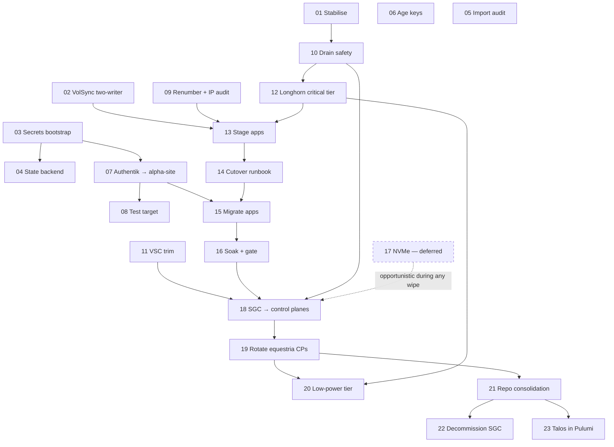

# Cluster consolidation — SGC folds into equestria

Planning set for [vault#84 — Migrate all kubernetes clusters into home-operations](https://github.com/david-driscoll/vault/issues/84).
Each numbered file is a standalone, executable plan for one migration piece. The letters
(A, B, C′…) are the sub-issue anchors established in the issue's
[Expansion v2](https://github.com/david-driscoll/vault/issues/84#issuecomment-5112255273)
and [v2.1](https://github.com/david-driscoll/vault/issues/84) discovery comments.

## The plan in one paragraph

**SGC folds into equestria.** Equestria keeps its identity, PKI, etcd, CIDRs (pods
`10.206.0.0/16`, services `10.196.0.0/16`, API VIP `10.10.206.201`) and every LoadBalancer
IP it has today. Of SGC's five unique apps, **authentik moves to alpha-site** (Docker on the
Pi, outposts stay in-cluster) and **chrony, mosquitto, tsidp and home-assistant move into
equestria**, with MQTT and NTP renumbering into `10.10.206.x`. Then SGC is dissolved: its
three nodes (milky-way, othalla, pegasus) are wiped one at a time and joined to equestria as
**control planes** (etcd 3→6), after which equestria's original control planes (hard-hat,
fluttershy, kerfuffle) rotate out one at a time and rejoin as **workers** (6→3).
shining-armor stays a worker. End state: 3 CP + 4 workers, one Flux tree in
home-operations, one age key, Pulumi state on a Postgres DIY backend on celestia, and a
rehearsed **low-power mode** where the cluster limps along on the three control planes
alone for 3–4+ hours on battery.

Equestria never loses etcd quorum at any step. **The only hard point of no return in the
entire plan is wiping the second SGC node** ([18](18-sgc-nodes-join-control-plane.md)).
Everything before that moment is reversible; the gate that makes it defensible is
[16 — soak and gate](16-soak-and-gate.md).

## ⚠️ Live findings, 2026-08-13 — read this before executing anything

Writing this plan involved live, read-only verification against both clusters (no
mutations were made). That verification found that **part of this migration has already
happened outside of any plan**, and surfaced **active production defects** unrelated to
planning. Nothing below was fixed — it's reported here so it isn't executed against as if
it were still true, and so the defects get picked up.

**Already executed, 2026-08-12, outside this plan and its staging/soak sequencing:**
`chrony`, `mosquitto` and `home-assistant` were cut from `stargate-command-cluster` to
`equestria-cluster` in a fast, paired commit sweep — without the `replicas: 0` staging step
[13](13-stage-sgc-apps.md) specifies, and **with SGC's copies fully deleted, not scaled to
0.** [14](14-cutover-runbook.md)'s "leave the SGC copy at 0, never delete" rule was not
followed for these three; there is no rollback path for them anymore. Only `tsidp` remains
to actually execute per the runbook. A **fifth app, `matter`** (a Matter/Thread bridge for
Home Assistant, sharing `${AUTOMATION_VIP}` with mosquitto), moved in the same sweep and
appears nowhere in the original five-app ledger or David's decisions on the issue — its
Tier-0/Tier-1 status is an open item ([20](20-low-power-tier.md) §8). A **sixth app,
`tsiam`** (Tailscale workload identity, [vault#115](https://github.com/david-driscoll/vault/issues/115)),
was found live on SGC and is also not in the original ledger — [15](15-migrate-apps.md)
flags whether it should be migrated alongside `tsidp`.

**Active defects found live, not caused by this plan:**

- **Home Assistant's MQTT integration is down right now** — its stored broker config still
  points at the dead cluster-local name `mosquitto.sgc.svc.cluster.local` from before the
  cutover. [15](15-migrate-apps.md) has the fix.
- **`chrony`'s NTP service is broken** — its Service exposes NTP over **TCP** instead of
  **UDP**; a live `sntp` query against `10.10.206.204` times out. [15](15-migrate-apps.md)
  has the fix.
- **Longhorn's HelmRelease is wedged in `UninstallFailed` on both clusters** — a side
  effect of an ahead-of-schedule partial repo-consolidation move (see below) that landed
  without the child Kustomizations picking up `postBuild.substituteFrom` for
  `CLUSTER_DOMAIN`/`SPIKE_IP`. No data lost — Longhorn's own safety guard is correctly
  refusing the uninstall Flux is trying to trigger — but it blocks the `nfs-csi`
  StorageClass and `volsync-system/volsync` on both clusters until fixed. This is
  [10](10-drain-safety.md)'s mandatory Step 0; **do not** clear it by flipping Longhorn's
  `deleting-confirmation-flag`.
- **`home-assistant`'s Flux Kustomization still references `components/volsync-restore`**
  past its removal point — an armed recurrence of
  [vault#120](https://github.com/david-driscoll/vault/issues/120)'s stuck-`ReplicationDestination`
  pattern, currently inert only because the Longhorn incident above is blocking
  reconciliation. Will refire the moment that's fixed unless addressed first.

**Also already underway, ahead of this plan's sequencing:** part of
[21](21-repo-consolidation-flux-repoint.md)'s repo consolidation — `longhorn-system`,
`nfs-system`, `cert-manager` and `openebs-system` moved from `equestria-cluster` into
`home-operations` on 2026-08-12/13. This worktree's branch was several commits behind
`origin/main` on exactly that directory at authoring time; re-sync before treating any
piece's "current state" claims about those namespaces as current.

**Corrections to the July/2026-07-29 discovery record**, now that the OpenBao migration has
completed and eleven days have passed:

- **PITR now works — it just hasn't been rehearsed.** [01](01-stabilise.md) re-verified
  live that WAL archiving and base backups are genuinely succeeding on both CNPG clusters
  (ten consecutive completed daily backups, 2026-08-03→2026-08-12). The "no PITR anywhere"
  framing carried since the July discovery is out of date; the operative caveat now is
  "restore has never been tested," not "archiving is broken."
- **The "shared restic repo, two-writer prune hazard" was never real.** [02](02-volsync-two-writer.md)
  found live that each cluster's VolSync movers mount a per-cluster NFS subdirectory
  (`/mnt/stash/backup/{sgc,equestria}/volsync`), not one shared repository keyed by app
  name — the July research read a vestigial, unused static PV. `technitium` and `registry`
  were never at risk from each other's prunes.
- **Several discovery-era blockers are already fixed**: the `StandardDns.ts` `import:` +
  `deleteBeforeReplace` DNS-wipe hazard (PRs #582, #605 — both landed *before* the comment
  that flagged them); [vault#113](https://github.com/david-driscoll/vault/issues/113)'s
  dual-default-StorageClass problem; [vault#139](https://github.com/david-driscoll/vault/issues/139)'s
  tainted shining-armor. [01](01-stabilise.md) has the full re-verification of every
  "new blocker" issue in the table below — five of six were resolved in practice despite
  still showing "open" on the tracker.
- **`hard-hat`'s "it's a Proxmox VM" status is genuinely ambiguous**, not settled as the
  July text assumed — its NIC MAC carries Proxmox's OUI, but its NFD hypervisor label reads
  `none` and it lacks the `qemu-guest-agent` extension every other VM in the estate has.
  [19](19-rotate-equestria-control-planes.md) flags this and gives an alternative node
  ordering; confirm against the Proxmox host inventory before relying on either.

## Decision ledger

Decisions David has made on the issue. Plans must not relitigate these.

| # | Decision | Where decided |
|---|---|---|
| D1 | Direction: SGC → equestria; never destructive to the surviving cluster | issue comments (inversion + Q9) |
| D2 | Pulumi state backend: Postgres DIY on **celestia**; Minio retained as versioned `stack export` archive | Q-A + v2.1 §1.4 |
| D3 | Drop `oxycloud`; drop **SGC's** `crowdsec` db (equestria's becomes live via [vault#111](https://github.com/david-driscoll/vault/issues/111)) | Q-B + vault#111 note |
| D4 | **Authentik moves to alpha-site** (Pi 4 + USB SSD); outposts stay in-cluster | Q-C |
| D5 | One age key: equestria's `age1eurl2t7…`; consolidate **before** the migration | Q-D / Q7 |
| D6 | Low-power CP-only mode is a first-class requirement: 3–4+ h deliberate posture on Pecron battery; **Home Assistant is Tier 1** | Q-E + follow-ups |
| D7 | MQTT **and** chrony renumber into `10.10.206.x`; no `.209` block is added to equestria's LB pool | Q-F + follow-up |
| D8 | GMKtec NVMe replacement **deferred** to its own hardware issue; not a dependency of the node phases | follow-up answers |
| D9 | Repo merge is a **greenfield** tree in home-operations based on equestria's; no history preserved | Q8 |
| D10 | Talos-in-Pulumi (`@pulumiverse/talos`) is a follow-on **after** the merge | Q10 + v2 §4 |
| D11 | Maintenance windows are fine; per-step reversibility beats speed | Q9 |
| D12 | Test-target re-designation away from alpha-site (skystar proposed) — **needs David's explicit confirmation** | v2.1 §9 item 3 |

## OpenBao secrets migration — how it's reflected across the pieces

The 1Password → OpenBao migration (below) is the biggest infrastructure change since the
July discovery, so it's threaded through more than just [03](03-secrets-bootstrap-independence.md).
A second pass, verified live against both clusters on 2026-08-13, added or confirmed:

- **Both clusters already run an identically-named `ClusterSecretStore/openbao`**, both
  `Ready: True`. An app's `ExternalSecret` needs no edit purely because it moves cluster —
  [13](13-stage-sgc-apps.md) and [21](21-repo-consolidation-flux-repoint.md) confirm this
  rather than assume it.
- **[01](01-stabilise.md)'s exit gate now checks OpenBao's own health**, not just the CNPG
  cluster its storage rides on.
- **[10](10-drain-safety.md)'s per-node rehearsal now checks OpenBao's active-instance
  failover** on every equestria node drained — OpenBao has no pod anti-affinity
  (`helmrelease.yaml` verified live), so its three pods land wherever the scheduler puts
  them, and today that includes the node piece 19 rotates first.
- **[13](13-stage-sgc-apps.md) and [22](22-decommission-sgc.md) now name the exact live
  `ExternalSecret`s** (20 of them, enumerated) still syncing on SGC's OpenBao mount for apps
  that already left — decommission debris, not a migration source, and a concrete ordering
  constraint on deleting the `kubernetes-sgc` mount (suspend the tree first).
- **[20](20-low-power-tier.md)'s decision to leave OpenBao dark during low-power** is now
  backed by live pod placement: none of OpenBao's replicas run on a node that will end up in
  the future critical tier, and the taint mechanism excludes it by construction, not by luck.

## What changed since the issue's discovery (2026-07-30 → 2026-08-12)

The v2/v2.1 discovery predates two waves of change; the plans reflect **today**:

1. **The 1Password → OpenBao migration completed** (vault `docs/openbao-migration/STATUS.md`,
   phases 0–11). Pulumi reads secrets only from OpenBao — which runs *in equestria*, backed
   by the shared CNPG postgres, transit-sealed from alpha-site. The bootstrap catch-22 is
   now OpenBao-shaped ([03](03-secrets-bootstrap-independence.md)); 1Password remains for
   PBS-item writes only, which is why the `CONNECT_HOST` repoint still matters; alpha-site
   is already load-bearing for the seal, which tightens both the authentik move
   ([07](07-authentik-to-alpha-site.md)) and low-power ([20](20-low-power-tier.md)).
2. **A dozen new vault issues intersect the plan** — notably
   [#127](https://github.com/david-driscoll/vault/issues/127) (equestria etcd collapses
   under /var write contention on the PNY SATA nodes — an argument *for* the CP handover,
   and fixed by construction in [19](19-rotate-equestria-control-planes.md)),
   [#139](https://github.com/david-driscoll/vault/issues/139) (shining-armor tainted since
   2026-08-05), [#130](https://github.com/david-driscoll/vault/issues/130)/[#126](https://github.com/david-driscoll/vault/issues/126)
   (wedged CNPG replica), [#119](https://github.com/david-driscoll/vault/issues/119)
   (WAL archiving — **re-verified fixed and working as of 2026-08-13**, see the live
   findings above; the tracker still shows it open),
   [#95](https://github.com/david-driscoll/vault/issues/95) (othalla NVMe media errors),
   [#134](https://github.com/david-driscoll/vault/issues/134) (snapshot cleanup stalled),
   [#113](https://github.com/david-driscoll/vault/issues/113) (two default StorageClasses),
   [#132](https://github.com/david-driscoll/vault/issues/132) (SGC CPU overcommit),
   [#120](https://github.com/david-driscoll/vault/issues/120) (volsync component bundles the
   ReplicationDestination). Each is folded into the piece it touches.

## The pieces

| File | Letter | What it delivers |
|---|---|---|
| [01-stabilise.md](01-stabilise.md) | A | Both clusters healthy: current blockers cleared, orphan deletions (`oxycloud`, SGC `crowdsec`, dead `adguard-home-dns` Service) |
| [02-volsync-two-writer.md](02-volsync-two-writer.md) | B | The shared-restic two-writer hazard turned out not to exist (each cluster already writes a separate repo); ordinary decommission hygiene only |
| [03-secrets-bootstrap-independence.md](03-secrets-bootstrap-independence.md) | C | A local `pulumi` run that survives both clusters being down, in the OpenBao era; `CONNECT_HOST` repoint |
| [04-pulumi-state-backend.md](04-pulumi-state-backend.md) | D | State on Postgres DIY (celestia); Minio becomes the versioned export archive |
| [05-import-audit.md](05-import-audit.md) | E | The permanent `import:` options audited before a DNS-heavy migration |
| [06-age-key-consolidation.md](06-age-key-consolidation.md) | F | One age recipient across every tree, rotated in-cluster |
| [07-authentik-to-alpha-site.md](07-authentik-to-alpha-site.md) | G′ | SSO off the cluster before the merge — fsync-tested, backed up, restore-verified |
| [08-test-target-redesignation.md](08-test-target-redesignation.md) | G″ | A new non-production test target once alpha-site is production |
| [09-mqtt-ntp-renumber-ip-audit.md](09-mqtt-ntp-renumber-ip-audit.md) | H′ | New `.206` addresses for MQTT/NTP + the literal-IP audit |
| [10-drain-safety.md](10-drain-safety.md) | I | All seven nodes provably drainable; Longhorn taint-toleration landed early |
| [11-volumesnapshotcontents-trim.md](11-volumesnapshotcontents-trim.md) | J | Snapshot-object churn trimmed before the apiserver moves to 16 GiB nodes |
| [12-longhorn-critical-tier.md](12-longhorn-critical-tier.md) | K′ | `critical`/`bulk` tags + StorageClasses that make low-power safe by construction |
| [13-stage-sgc-apps.md](13-stage-sgc-apps.md) | L | The four migrating apps staged (suspended) in equestria's Flux tree |
| [14-cutover-runbook.md](14-cutover-runbook.md) | M | The per-app cutover runbook, traps inline |
| [15-migrate-apps.md](15-migrate-apps.md) | N | chrony → mosquitto → tsidp → home-assistant executed |
| [16-soak-and-gate.md](16-soak-and-gate.md) | O | ≥72 h soak + the go/no-go checklist that guards the point of no return |
| [17-nvme-replacement.md](17-nvme-replacement.md) | P′ | **Deferred** — the GMKtec etcd-disk swap, and the risk accepted meanwhile |
| [18-sgc-nodes-join-control-plane.md](18-sgc-nodes-join-control-plane.md) | Q | SGC dissolved; its nodes join as control planes (3→6). **Contains the point of no return** |
| [19-rotate-equestria-control-planes.md](19-rotate-equestria-control-planes.md) | R | equestria's CPs rotate to workers (6→3); strict-local CNPG relocation per node |
| [20-low-power-tier.md](20-low-power-tier.md) | S′ | The CP-only operating mode: tiers, placement, enter/exit runbook, rehearsal |
| [21-repo-consolidation-flux-repoint.md](21-repo-consolidation-flux-repoint.md) | T | One tree in home-operations; Flux re-pointed with `prune: false` during the switch |
| [22-decommission-sgc.md](22-decommission-sgc.md) | U | Every SGC reference retired: VIP, DNS, stacks, OpenBao mounts, cluster definitions, repos archived |
| [23-talos-in-pulumi.md](23-talos-in-pulumi.md) | V | Follow-on: machine config via `@pulumiverse/talos`, talhelper retired |

## Sequencing

Critical path: **01 → 10 → 18 → 19 → 20**, with **07 (authentik) off to the side and
finishing before 15**. 07 is the highest-value early item: it removes SSO from the
migration's blast radius entirely.

The cross-cutting rules that apply to every node-touching phase:

- **One node at a time, always**, with an explicit etcd-healthy + Cilium-ready +
  Longhorn-rebuilt gate between nodes. A full-cluster restart has previously produced the
  zombie-node cascade (Cilium-not-ready → instance-manager `OutOfcpu` → Longhorn/CNPG
  wedged → physical power-cycle). If a node comes back wrong, check nodes and taints first,
  not CNPG.
- **PITR works but is unrehearsed** ([vault#119](https://github.com/david-driscoll/vault/issues/119),
  re-verified live 2026-08-13 — see live findings above): treat the nightly dump as the
  operative rollback mechanism until a WAL-based restore has actually been proven. Every
  phase that touches a database takes and *verifies* a dump first regardless.
- **CNPG surgery** is `kubectl cnpg destroy`, never manual PVC deletion; CNPG instances are
  `strict-local` and cannot be rescheduled — only destroyed and re-provisioned.
- **`pulumi refresh` is a trap** on these stacks (UniFi read-404); targeted `--target` only.
- **Flux re-points run with `prune: false`** for the duration of the switch.
